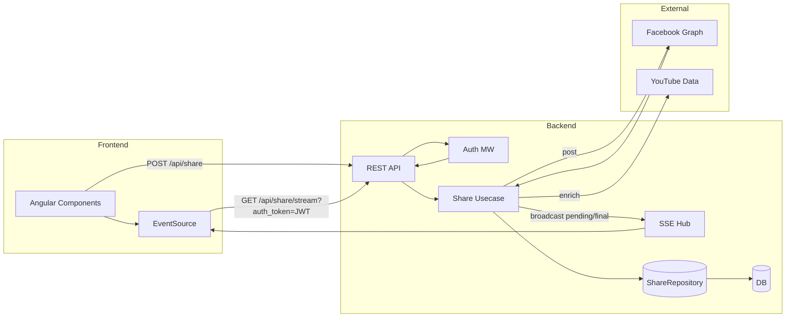
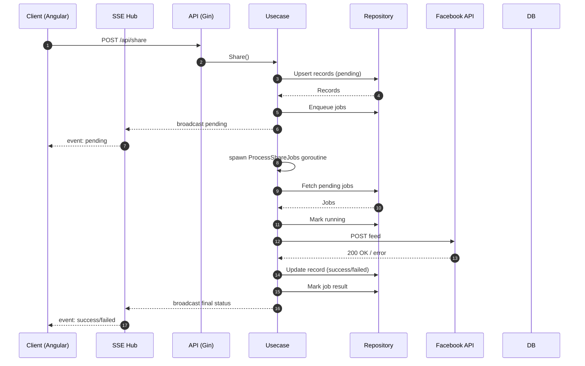

# Architecture Overview

## Scope
Focus on the share subsystem and real-time (SSE) delivery path added to support instant UI feedback for social shares.

## High-Level Components
- API Layer (Gin HTTP handlers)
- Middleware (Auth: extracts JWT from header or `auth_token` query for SSE)
- Usecases (Business logic: `share_usecase` orchestrates share lifecycle)
- Persistence (ShareRepository: share records, jobs, audits)
- Realtime Hub (In‑memory SSE hub per user)
- External Providers (Facebook Graph API, YouTube Data API for enrichment)

### Component Diagram (Mermaid)
Source: `docs/diagrams/share_components.mmd`

GitHub renders fenced Mermaid automatically; for an exported image run (after installing mermaid-cli globally):
```bash
npm install -g @mermaid-js/mermaid-cli
mmdc -i docs/diagrams/share_components.mmd -o docs/diagrams/share_components.png
```



```
+-----------+       +-------------+       +-----------------+        +------------------+
|  Angular  | <---> |   REST API  | <---> |  Usecase Layer  | <----> |  ShareRepository |
|  (UI)     |       |  (Gin)      |       | (share_usecase) |        |  (DB + jobs)     |
+-----+-----+       +------+------+       +------+-----------+        +---------+--------+
      |                     ^                    |                               |
      | SSE (EventSource)   | JWT / auth_token   | callbacks (broadcast)         | SQL CRUD
      v                     |                    v                               v
+------------------+        |          +--------------------+          +--------------------+
|  SSE Hub         | <------+          |  External Services |          | Audit / Analytics  |
| (per-user chans) |                  | (FB Graph, YouTube) |          | (future metrics)   |
+------------------+                  +--------------------+          +--------------------+
```

## Data Model (Simplified)
```
video_share_records(
  id PK,
  user_id,
  video_id,
  platform,            -- e.g. facebook
  status,              -- pending | success | failed
  attempt_count,       -- increments per processing attempt (includes retries)
  external_ref,        -- provider post id (e.g. facebook feed id)
  error_message,
  created_at,
  updated_at
)

share_jobs(
  id PK,
  record_id FK -> video_share_records.id,
  platform,
  status,        -- pending | running | done
  attempts,      -- raw attempt counter for the job row
  created_at,
  updated_at
)

video_share_audits(
  id PK,
  record_id,
  video_id,
  user_id,
  platform,
  status,
  error_message,
  created_at
)
```

## Share Flow (server_post mode)
1. Client POST `/api/share` (video_id, platforms, mode=server_post, force?)
2. Usecase validates platforms & creates/updates `video_share_records` (status=pending)
3. Jobs enqueued into `share_jobs` (status=pending)
4. Immediate SSE broadcast (pending) for each platform
5. Goroutine kicks off `ProcessShareJobs` with a bounded timeout
6. Processor fetches pending jobs (batch)
7. For each job (facebook):
   - Load record + token
   - Compose message (title/description + hashtags + YouTube watch URL)
   - POST to Facebook Graph API
   - On success: update record status=success, external_ref=post id
   - On transient failure (network/5xx/429): mark failed + single retry (reset job->pending)
   - On permanent failure: record status=failed, error_message set
8. After each terminal attempt (success/failed), broadcast SSE event
9. UI updates badges/spinners accordingly

### Sequence Diagram (Mermaid)
Source: `docs/diagrams/share_sequence.mmd`

Export command example:
```bash
mmdc -i docs/diagrams/share_sequence.mmd -o docs/diagrams/share_sequence.svg
```



## SSE Hub Mechanics
- Map[userID] -> set of subscriber channels
- `Serve` registers channel, streams events (`event: share_status`)
- Broadcaster callback invoked by usecase / processor to push events
- Backpressure avoided via buffered channels + non-blocking send (drop-if-full policy protects server)
- Hub is ephemeral (in-memory). A page refresh requires resubscription; missed events can be reconciled via REST `GET /api/share/status?video_id=...` (future improvement).

## Retry Strategy
Current: Single retry for facebook when `post_request_failed` or HTTP >=500 or 429.
Future: Exponential backoff queue with jitter + max attempts configurable via env.

## Timeouts
- Immediate processing goroutine: 30s context (prevents long tail blocking request scope)
- Individual Facebook POST: 10s request timeout to isolate slow network calls
- YouTube enrichment: 2s (non-critical)

## Concurrency & Safety
- Each job marked running before external call
- Attempt count increments inside repository (not shown here) ensuring atomicity
- Record copy used in goroutine broadcast to avoid data races

## Security Considerations
- SSE uses `auth_token` query param: token exposure risk in browser history; acceptable for internal/admin usage. For public deployment consider short-lived tokens or a one-time stream key.
- CORS restrictions should include the Angular frontend origin.

## Failure Modes & Mitigations
| Failure | Mitigation |
|---------|------------|
| Network timeout to Facebook | 10s per-request timeout + retry |
| Repeated transient failures | (Future) Backoff with jitter |
| Hub memory growth | Non-blocking send drops excess; channel buffer size tuned (8) |
| Lost events (page refresh) | (Future) Add REST refresh endpoint (already partially available via status query) |
| Unauthorized SSE access | Middleware enforces JWT via query param |

## Extension Points
- Add new platforms: implement platform branch in `ProcessShareJobs` switch (token lookup, post logic) and allowlist it when constructing usecase
- Metrics: Wrap broadcaster to emit Prometheus counters (success/failure/latency)
- Queue abstraction: Replace direct DB polling with Redis / RabbitMQ preserving broadcaster callback

## Sequence Diagram (Text)
```
Client -> API: POST /api/share {video, platforms:[facebook], mode:server_post}
API -> DB: upsert records (pending)
API -> Hub: broadcast pending
API -> Worker(Goroutine): start job processing
Worker -> DB: fetch pending jobs
Worker -> External(FB): POST message
External(FB) --> Worker: 200 OK (id=...)
Worker -> DB: update record success + external_ref
Worker -> Hub: broadcast success
Hub -> Client(EventSource): event: share_status {status:success}
```

## Testing Tips
- Simulate network failure: temporarily block outbound to graph.facebook.com; observe retry then failed event
- Confirm SSE stream: browser DevTools -> Network -> EventStream -> frames

## Roadmap Snapshot
- [ ] Configurable max retries / backoff
- [ ] Persisted retry schedule
- [ ] Replay endpoint for missed events
- [ ] Metrics + dashboards
- [ ] Platform abstraction interface

---

This document complements the README `Real-time Share Status (SSE)` section with deeper architectural context.
